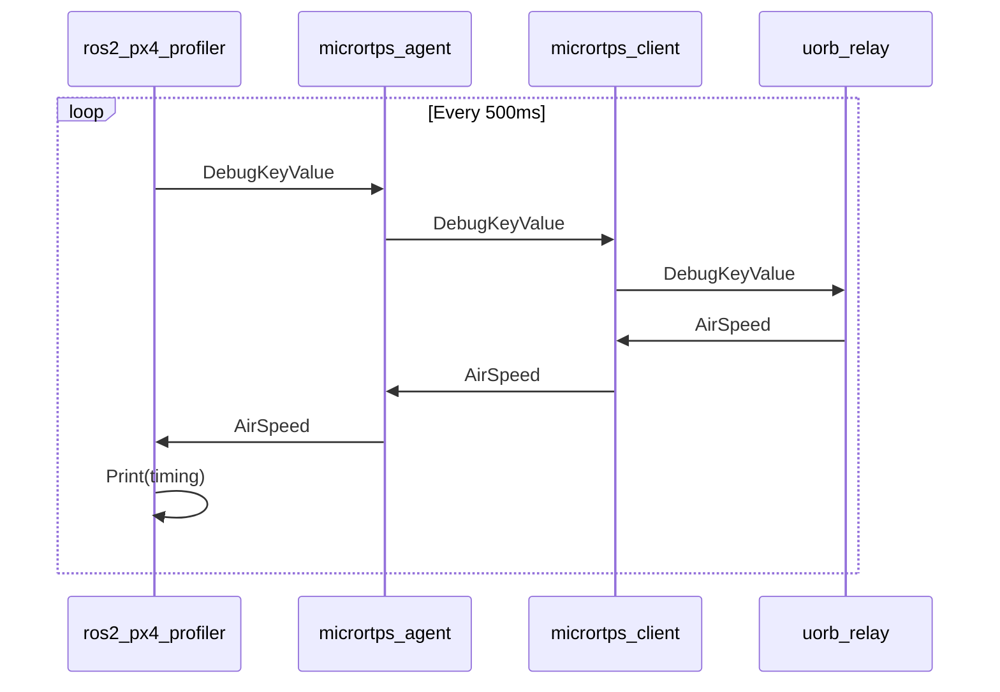

# Basic example source code to measure round trip time from ROS2 -> PX4 -> ROS2

This done by sending a ROS2 msg to the /DebugKeyValue_PubSubTopic with a timestamp value

This ROS2 msg will be transfered to PX4 using px4_ros_com

PX4 on a FMU will relay the msgs from the DebugKeyValue uORB topic to the Airspeed topic uORB

The px4 micrortps_client sends back the data to the px4_ros_com and px4_ros_com sends the data to the ROS2 domain

The ROS2 listener will listen to msgs on the /Airspeed_PubSubTopic and prints out the relative time it took

## UML diagram

